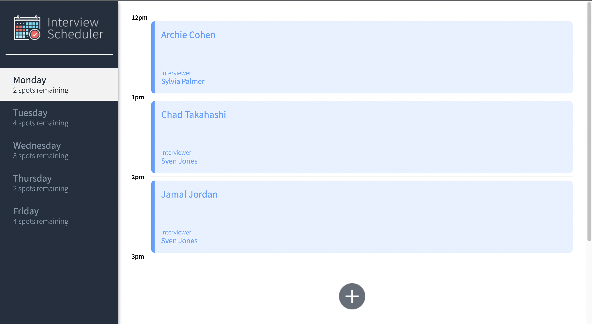
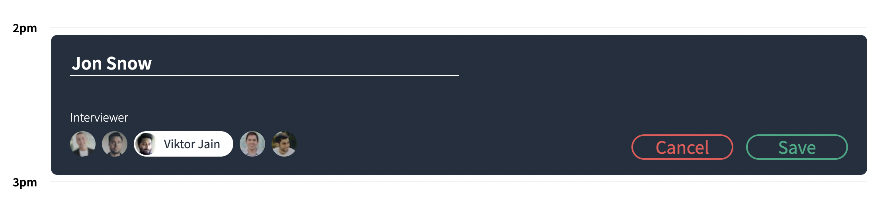
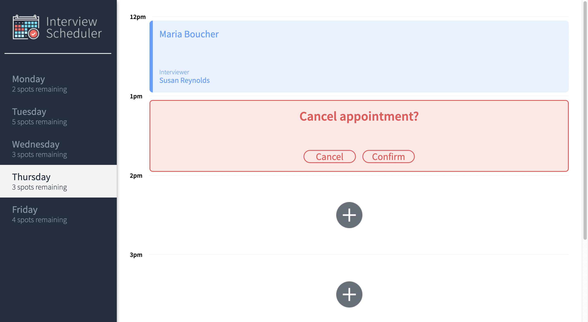

# Interview Scheduler

A single-page application built with React that allows users to view, book, edit and cancel interviews.

## Screenshots

<h3>List of appointments</h3>



<h3>Appointment form</h3>



<h3>Cancellation Prompt</h3>



## Setup

Clone repo and install dependencies with `npm install`.

## Running Webpack Development Server

<br />

> **The Webpack Development Server will run on port 8000.**

<br />

```sh
npm start
```

## Running Jest Test Framework

<br />

You can run the included unit and integration tests by running:

```sh
npm test
```

## Running Storybook Visual Testbed

<br />
You can view the included storybook stories by running:<br /><br />

```sh
npm run storybook
```

## Dependencies

- Axios
- react
- @testing-library/react-hooks
- react-test-renderer
